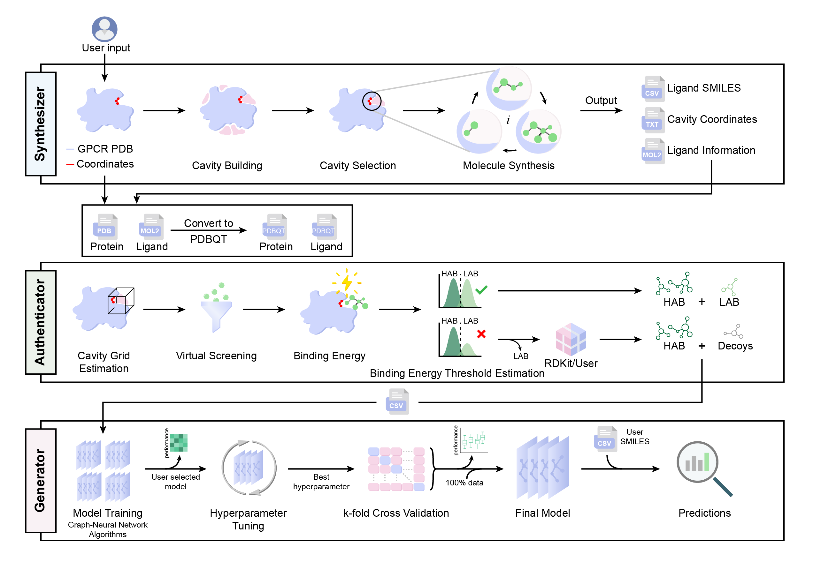

# Interactome Prediction using Gcoupler
 <br>
<div align="center">
</div>
<br>

### Introduction

Gcoupler leverages an integrative approach combining _de novo_ ligand design, statistical methods, and Graph Neural Networks for rational prediction of high-affinity ligands. Gcoupler offers an efficient and comparatively faster route to explore endogenous allosteric sites of GPCRs, including the GPCR-Gα interface. <br/><br/>


## How to use Gcoupler?


### A. Pre-compiled Docker container
<br>
<div align="center">
</div>
<br>

This is the repo of the official [Docker image](https://hub.docker.com/r/sanjayk741/gcoupler) for **Gcoupler**. Click [here](https://github.com/the-ahuja-lab/Gcoupler/blob/main/docker/README.MD) for the full readme on how to use the Docker image.

The full readme is generated over in docker/README.

Instructions for installing and running docker on any PC can be found [here](https://docs.docker.com/engine/install/) 
1. [Windows](https://docs.docker.com/desktop/install/windows-install/)
2. [MacOS](https://docs.docker.com/desktop/install/mac-install/)
3. [Linux](https://docs.docker.com/desktop/install/linux-install/)

## OR

### B. Building from dependencies

The only strong dependencies for this resource are [**RDKit**](https://www.rdkit.org/) and [**DeepChem**](https://github.com/deepchem/deepchem), which can be installed in a local [Conda](https://conda.io/) environment.


**Package dependencies**
1. [seaborn (>=0.11.2)](https://pypi.org/project/seaborn/)
2. [pandas (>=1.3.5)](https://pandas.pydata.org/)
3. [numpy (>=1.21.6)](https://numpy.org)
4. [py3Dmol (>=0.9.2)](https://pypi.org/project/py3Dmol/)
5. [scipy (>=1.5.2)](https://pypi.org/project/scipy/)
6. [matplotlib (>=3.2.2)](https://pypi.org/project/matplotlib/)
7. [rdkit-pypi (>=2020.9.5)](https://pypi.org/project/rdkit-pypi/)
8. [deepchem (>=2.5.0)](https://pypi.org/project/deepchem/)
9. [imblearn](https://pypi.org/project/imblearn/)
10. [vina (>=1.2.0.dev3)](https://pypi.org/project/vina/)
11. [scikit-learn (>=0.22.2)](https://pypi.org/project/scikit-learn/)
12. [dgl (>=0.7.2)](https://pypi.org/project/dgl/)

The installation procedure takes less than 5 minutes.
```
$ pip install <package-name>
```

**OR**

Click [here](https://drive.google.com/file/d/1jcNsmVmlI3WQQ0hHAWyXPt6ie_t1tQDv/view?usp=sharing) to download a dependencies.txt file and setup the environment by 
```
$ pip install -r dependencies.txt
```


**Third-party dependencies**
1. [LigBuilder V3.0](https://drive.google.com/file/d/1xFZCJeWCpBkaN24UFHCQUYWYmce2bx7Y/view?usp=sharing)
2. [OpenBabel (2.4.1)](https://drive.google.com/file/d/1SZo8op62KRyTzHmg5RMsUtxkH8oFp357/view?usp=sharing)

The installation procedure takes less than 5 minutes.

**Installation of LigBuilderV3**
```
$ tar –xvzf LigBuilderV3.0.tar.gz
$ cd LigBuilderV3.0/
$ chmod 775 configure
$ ./configure
```
**Installation of OpenBabel**
```
$ tar –xvzf openbabel-2.4.1.tar.gz
$ mkdir build
$ cd build
$ cmake ..
$ make -j2
$ sudo make install
```

**Installation of Gcoupler**
```
$ pip install Gcoupler
```

## Pipeline
Gcoupler supports three distinct modules:<br/>
1. Synthesizer
2. Authenticator
3. Generator

### Synthesizer

To identify the putative cavities on the protein surface with the potential to be an active or an allosteric site and perform _de novo_ drug synthesis 
```
>>> import Synthesizer as sz
```
Set paths for the installed third-party software and default output folder to collect the intermediate result files and plots
```
>>> sz.Set_paths(LigBuilder_path='path to LigBuilderV3.0/',libiomp5_file='path to libiomp5.so file containing folder/',Output_dir='path to deafult folder/')
```
**Note:** to find the folder containing libiomp5.h file
```
$ find / -name libiomp5.so
```
To submit the query protein file of interest in PDB format
```
>>> sz.input_structure(path='pre-set deafult Output folder/',pdb='path to pdbfile.pdb')
Cavity will output 16 cavity file(s)
```
Output shows the total number of cavities predicted (in this case, 16), which can be visualized by it's integer identifier.
```
>>> cavity=4 #To select cavity number 4 as the target cavity
>>> sz.cavity_view(path='pre-set default Output folder/',CvID=cavity)
```

Users can either directly choose a cavity number for the ligand synthesis.
```
>>> cavity=4 #To select cavity number 4 as the target cavity
>>> sz.compund_synthesis(path='pre-set default Output folder/',CavID=cavity)
```
Or the user can opt for cavity detection by submitting residue of interest in a TSV (Tab-separated) file.
```
>>> sz.cavity_detect(path='pre-set deafult Output folder/',res_list='Residue_list.tsv')
```
Residue_list.tsv (The first column contains the Single-letter amino acid codes, and the second column their respective positions)
```
$ head -5 Residue_list.tsv
E       305
T       306
I       310
Y       316
V       466
```
**Note:** No header should be provided in the TSV file

##### Optional 

User can specify the number of compounds to synthesize (Default: 500)
```
>>> cavity=4 #To select cavity number 4 as the target cavity
>>> lcount=800 #To synthesize 800 compounds 
>>> sz.compund_synthesis(path='pre-set default Output folder/',CavID=cavity, ligand_count=lcount)
```
OR
```
>>> lcount=800 #To synthesize 800 compounds 
>>> sz.cavity_detect(path='pre-set default Output folder/',res_list='Residue_list.tsv', ligand_count=lcount)
```

##### Output folder
The output folder will contain the following files at the end of the successful execution of Synthesizer module
| Files | Description |
| -------- | -------- |
| Progress.st | Status file containing Gcoupler progress |
| Synth.csv | CSV file containing SMILES of the synthetic compounds  |
| PDBQT files | Docking ready synthetic compounds |


### Authenticator

To segregate the synthetic compounds into binary classes based on their actual interaction at the molecular level
```
import Authenticator as au
```
To calculate the interaction (binding energy) of individual synthetic compounds with the target cavity (in which they are synthesized)
```
>>> au.synthetic_interaction(path='pre-set deafult Output folder/')
```
Additional arguments:
1. method: Statistical test to use for binding energy cutoff estimation

| Parameter Name | Description |
| -------- | -------- |
| KS-test | Kolmogorov-Smirnov test (Default) |
| ES-test | Epps-Singleton test |
| AD-test | Anderson-Darling test |

3. p_val: Significance cutoff for the statistical test (Default: 0.05)
4. plot: Plot to visualize the distribution of HABs and LABs at each qualified cutoff

| Parameter Name | Description |
| -------- | -------- |
| Density | Density distribution plot (Default) |
| ECDF | Empirical cumulative distribution function plot |

Example
```
>>> au.synthetic_interaction(path='pre-set deafult Output folder/',method='KS-test',p_val=0.05,plot='Density')
```

To classify synthetic compounds into binary classes of HAB & LAB based on binding energy cutoff (Default: -7)
```
>>> cutoff = -9  #user decided binding energy cutoff for synthetic compound binary classification 
>>> au.synthetic_classify(path='pre-set default Output folder/',cf=cutoff)
```

In case user want to opt for decoys as negative class against HABs
```
>>> au.synthetic_decoys(path='pre-set deafult Output folder/')
```
Additional arguments:

| Arguments | Description |
| -------- | -------- |
| cf | User-specified binding energy cutoff for HABs, for which decoys will be generated (Default: -7) |
| decoy_csv | A CSV file containing two columns. **SMILES** column containing the compound SMILES, and **Annotation** column containing its class information HAB (output from the previous function) or Decoy |

Decoy_data.csv
```
$ head -5 Decoy_data.csv
SMILES,Annotation
O(CC1CO1)c2cccc3ccccc23,HAB
Nc1nc(N)nc2ncc(CN(C)c3ccc(cc3)C(=O)NC(CCC(=O)O)C(=O)O)nc12,HAB
N(N=C(C)CCCCCC)c1ccc(cc1[N+](=O)[O-])[N+](=O)[O-],Decoy
C(CCCCCC)CCC[Se]C#N,Decoy
```
**Note:** User should use either **synthetic_classify** or **synthetic_decoys** function to proceed with not both 

##### Output folder
The output folder will contain the following files at the end of the successful execution of Authenticator module
| Files | Description |
| -------- | -------- |
| Synth_BE.csv | CSV file containing SMILES and binding energy data of the synthetic compounds |
| Labeled_cmps.csv | CSV file containing SMILES and class information (HAB/LAB) of the synthetic compounds |
| PDF files | Distribution plots at each qualified cutoff with balanced classes, containing information about the statistical test performed and respective p-value |


### Generator

To build Graph-Neural Network-based classification models for large-scale screening of the user query compounds 
```
>>> import Generator as ge
```
To pre-process the binary data (HAB & LAB) and test against four base models
1. GCM: GraphConv Model
2. AFP: Attentive FP
3. GCN: Graph Convolution Network
4. GAT: Graph Attention Network
```
>>> ge.multi_model_test(path='pre-set deafult Output folder/')
```
##### Optional 
Users can provide pre-compiled binary data for multi-model testing (limited to this function only)
```
>>> data='/home/username/cmp.csv' #cmp.csv file containing "SMILES" & "Status" column with SMILES of compounds and 1/0 as class information respectively 
>>> ge.multi_model_test(path='pre-set deafult Output folder/',fi=data)
```

Save the base model scoring metrics as Pandas data frame
```
>>> matrices = ge.multi_model_test(path='pre-set deafult Output folder/',fi=data)
```
To select the best-performing model for the hyperparameter tuning (HPT) with K-Fold cross-validation 
```
>>> ge.MD_kfold(path='pre-set deafult Output folder/',mdl='GCN',k=5)
```
Additional arguments:

| Arguments | Description |
| -------- | -------- |
| k | Fold value (int) for model cross-validation on the best hyperparameters (Default: 3) |
| params | A dictionary with parameter names as key and respective grid as value |

Users can either opt for Gcoupler predefined hyperparameter grid for the selected model of interest for HPT.

OR

Users can also specify the range of each hyperparameter for the selected model of interest for HPT.

Modifiable Hyperparameter list:
| Model | Parameters | Data type |
| -------- | -------- | -------- |
| GCM | number_atom_features | list of int, e.g., [50,100,150,200] |
|  | graph_conv_layers | list of lists of layers, e.g., [[32,32],[64,64],[128,128]] |
|  | dropout | list of floats, e.g., [0, 0.1, 0.5] |
|  | batch_size | list of int, e.g., [10,20,30,40]  |
|  | dense_layer_size | list of int, e.g., [120,140,160,180,200]  |
| AFP | num_layers | list of int, e.g., [10,20,30,40] |
|  | num_timesteps | list of int, e.g., [5,10,15,20] |
|  | graph_feat_size | list of int, e.g., [125,150,175,200] |
|  | dropout | list of floats, e.g., [0, 0.1, 0.5] |
| GCN | batch_size | list of int, e.g., [10,15,20,25]  |
|  | graph_conv_layers | list of lists of layers, e.g., [[32,32],[64,64],[128,128]] |
|  | predictor_hidden_feats | list of int, e.g., [100,150,200,250,300] |
|  | learning_rate | list of float, e.g., [0.01,0.1,1.0] |
|  | predictor_droput | list of int, e.g., [0,1] |
| GAT | alpha | list of floats, e.g., [0.1,0.2,0.4] |
|  | dropout | list of floats, e.g., [0, 0.1, 0.5] |
|  | n_attention_heads | list of int, e.g., [5,10,15,20] |

##### Optional
Users can opt for hyperparameter tuning of any selected model without K-Fold cross-validation (Only for testing different hyperparameter grid range)
```
>>> ge.model_hpt(path='pre-set deafult Output folder/',mdl='GCN', params={dictionary}) #dictionary=['parameter name':[parameter grid]]
```
**Note:** The above function does not create a model for large-scale screening.

##### Output folder
The output folder will contain the following files at the end of the successful execution of Generator module
| Files | Description |
| -------- | -------- |
| PDF files | Heatmap of base model performance metrics, Boxplot of K-Fold cross-validation, Base model Test/Train AUC plots |
| Model Folders | Folders containing base model checkpoints |
| KFoldCV | Folder containing  K subfolders with model checkpoints for each fold |
| model_100 | Folder containing Graph-Neural Network model checkpoints trained on 100% synthetic data for **Large-scale screening** |


## Large-scale screening
To predict the binding probability for individual query compounds 
```
>>> import Generator as ge
```
Prepare a list of canonical SMILES (OpenBabel generated) strings of the query compounds
```
>>> smiles =  ['ClCC=C', 'C=CCOC(=O)CC(C)C', ...]
```
Run predictions on a pre-trained Graph-Neural Network model (Model selected for K-Fold cross on the last run)
```
>>> ge.MD_pred(path='pre-set deafult Output folder/',smi_list=smiles)
```
Save the result as Pandas data frame
```
>>> result = ge.MD_pred(path='pre-set deafult Output folder/',smi_list=smiles)
```
