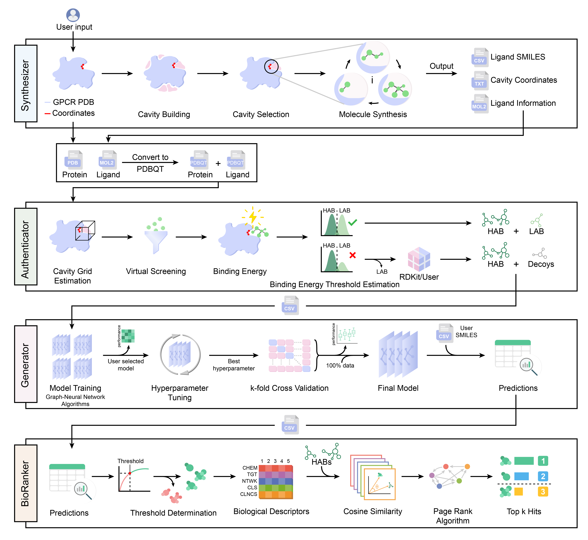

# Interactome Prediction using Gcoupler
 <br>
<div align="center">
</div>
<br>

### Introduction

Gcoupler, which leverages an integrative approach combining de novo ligand design, statistical methods, and Graph Neural Networks for rational prediction of high-affinity ligands. Gcoupler offers an efficient and comparatively faster route to explore endogenous allosteric sites of GPCRs, including the GPCR-Gα interface. <br/><br/>


The only strong dependency for this resource is [**RDKit**](https://www.rdkit.org/) and [**DeepChem**](https://github.com/deepchem/deepchem) which can be installed in a local [Conda](https://conda.io/) environment.


Click here[] to download a copy of pre-complied conda environment yml file and setup by 
```
$ conda env create -f Gcoupler.yml
$ conda activate Gcoupler
```

**Tool dependencies**
1. [LigBuilder V3](https://gitlabsbnb.irbbarcelona.org/packages/signaturizer)
2. [OpenBabel(2.4.1)](https://github.com/marcotcr/lime)
